# Agile

## Introduction

Agile planning methodology was used to create the site Café-Board. GitHub projects was used to organise the development process into sprints, epics, Kanban boards and issues.  This was the first time I have undertaken a project that was driven by the agile development process and a learning curve was associated with the development of this project, however the benefits of an agile approach soon outweighed the learning curve associated. I first started by creating issues. These where user stories that had a detailed acceptance criteria and unit tasks associated with each issue. These issues where also labelled using the MoSCoW technique. Each issue was then sorted into the epic in which it belonged. I also compartmentalised each epic into stints for the development process. One stint contained many epics and within this many issues. This project was completed over Four stints of work.

## Benefits of agile development

As mentioned in the introduction there was a learning curve associated with using agile development for the first time, however there was a received number of benefits associated as well. These benefits include:

1. Having a plan in place. It was easier to know which task I was working on and found myself getting less distracted as I was carrying out the work associated with the project.
2. Having a dedicated timeframe for issues to be done. This helped me stay on track in terms of timeframe for the project.
3. Initial overall planning of the project. As a lot of thought went into the user stories I was able to have a better picture of the overall project before starting the work. This sped up production and definitely felt more organised.
4. Easily see the benefits of collaboration. As I was working on this project on my own it was easy to see how the use of agile would benefit collaboration if multiple people where working on a project together. Especially with the Kanban board, being able to see what is being worked on and the status of the work and also being able to assign this work to individual developers.

## MoSCoW

MoSCoW analysis helps developers understand which tasks to prioritise. It is a process by which labels are added to issues. These labels include 'Must-have', 'Could-have', 'Should-have' and ' Wont-have'.  In my project I had nearly an equal amount of 'Must-have' and 'Should-have' labels. On reflection I should have prioritised more 'Must-have' I also did not use 'Wont-have' and 'Could-have' in this project and this is something I would considering using more of in future projects as I found this technique useful to determine important work to be carried out.  The image below shows a portion of the issues associated with this project and their labels in place.

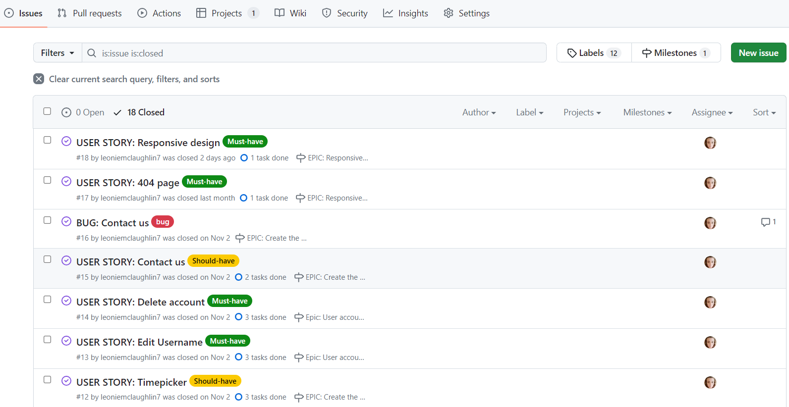

## Epics

An agile epic is a body of work that can be broken down into smaller segments. Seven epics where created for this project. These epics where created using GitHub Milestones and each user story that corresponded to the epic was linked to each epic. The amount of user stories in each epic was depended on the project but they range from Two to Seven user stories. 

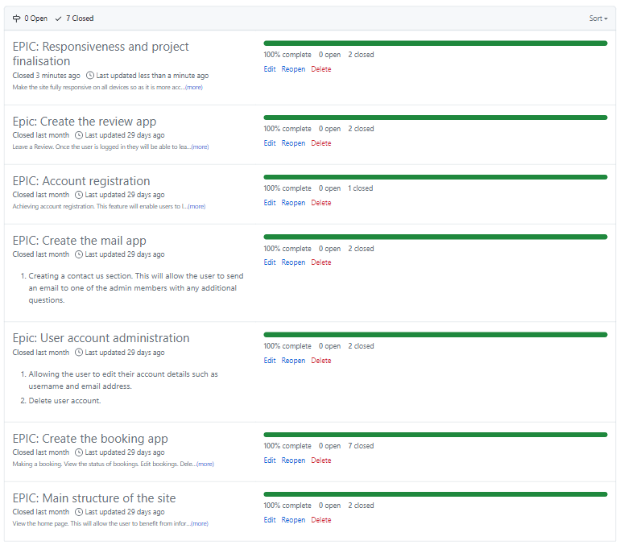

The Seven epics where:

1. [Account registration](https://github.com/leoniemclaughlin7/cafe-board/milestone/1?closed=1)

 

Achieving account registration. This feature enables users to login and set up accounts on the site. It is also the bases for functionality that requires a user to be logged in.

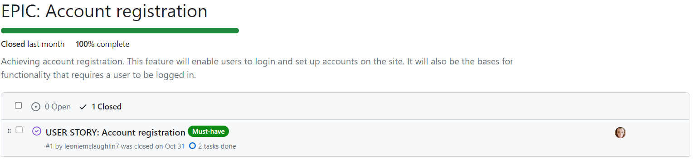

2. [Main structure of the site](https://github.com/leoniemclaughlin7/cafe-board/milestone/5?closed=1)

 

This epic revolved around setting up the main structure of the site. This included the user being able to view both the home and the menu page.

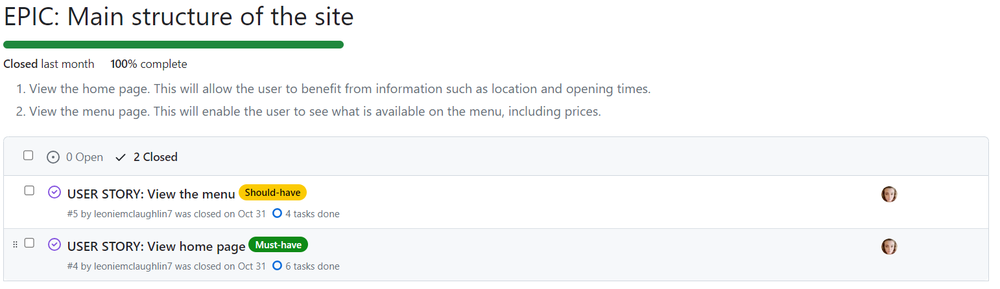

3. [Create the review app](https://github.com/leoniemclaughlin7/cafe-board/milestone/6?closed=1)

 

This epic was associated with leaving a Review. Once the user is logged in they are able to leave a review and view reviews. On the home page the user is able to see a scrollable list of reviews.

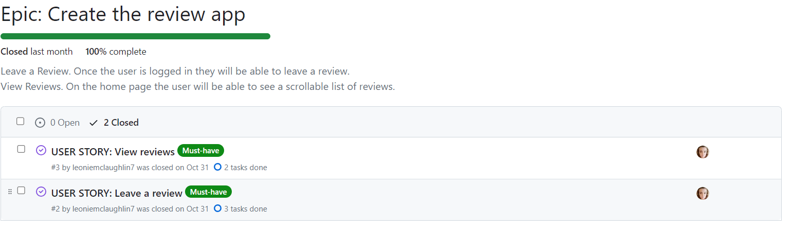

4. [Create the booking app](https://github.com/leoniemclaughlin7/cafe-board/milestone/2?closed=1)

 

This was the largest epic comprising of Seven user stories all associated with leaving a booking on the site. This epic was comprised of making a booking, view the status of bookings, edit bookings, delete bookings,  as admin approve bookings and Implementing a booking calendar in the booking form. To include excluding dates that are fully booked. Finally Implementing a timepicker for the booking form.

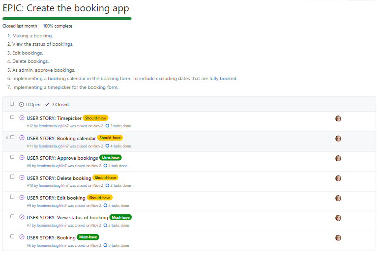

5. [User account administration](https://github.com/leoniemclaughlin7/cafe-board/milestone/3?closed=1)

 

This epic allowed the user to edit their account details such as username and email address and delete their user account.

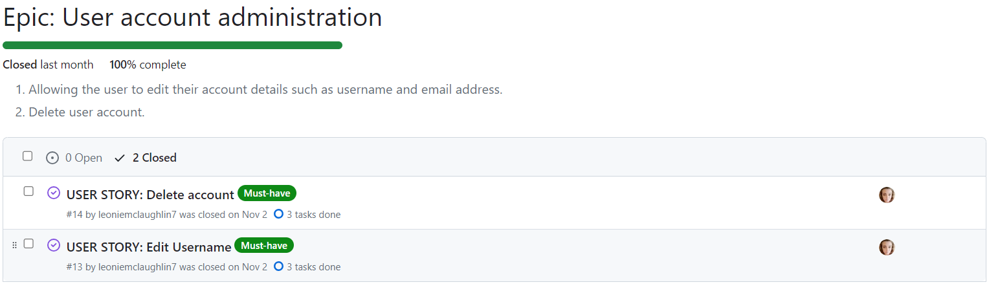

6. [Create the mail app](https://github.com/leoniemclaughlin7/cafe-board/milestone/4?closed=1)

 

This epic was associated with creating a contact us section. This will allow the user to send an email to one of the admin members with any additional questions they might have.

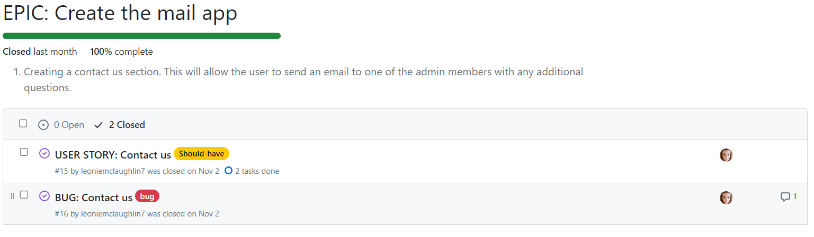

7. [Responsiveness and project finalisation](https://github.com/leoniemclaughlin7/cafe-board/milestone/7?closed=1)

 

This epic resulted in the site being fully responsive on all devices so as it is more accessible to users and also creating a 404 page, so as users are aware if they try to enter a page that is not found.

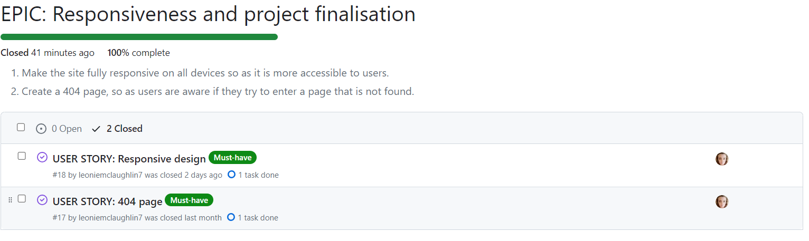

## User stories 

A user story is an explanation of a software feature written from the perspective of the end user. Its purpose is to articulate how a software feature will provide value to the customer. User stories were created with the help of GitHub issues. Each user story contains:
* Title - Short description of the user story. 
* Description - As a **role** i can **capability** so that **received benefit**.
* Acceptance criteria - A set of conditions that a feature must meet to be accepted by the user. 
* Unit tasks - A break down of each task needed to complete user story. 
* A MoSCoW label - To prioritise tasks. 
* Assignee -  Who the user store is assigned too. 
* Milestone - Which epic this user store is associated with.

Below is an example of how the user stories where structured for this project.

 

A full list of the user stories associated with this project can be found [here.](https://github.com/leoniemclaughlin7/cafe-board/issues?q=is%3Aissue+is%3Aclosed)

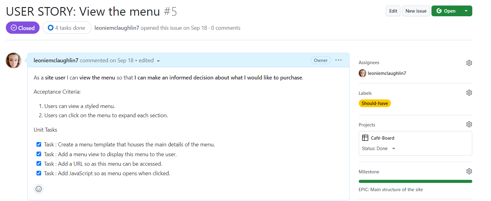

In total 18 User stories where created. In reflection there was opportunity to have many more user stories for the size of this project and more planning could have been done to facilitate a more detailed agile user story count. This is something which I will take forward into future projects carried out.

## Stints

This project was broken down into Four stints of varying duration. The plan was to allow a week for each stint, however this changed during development and some stints required more time than others.

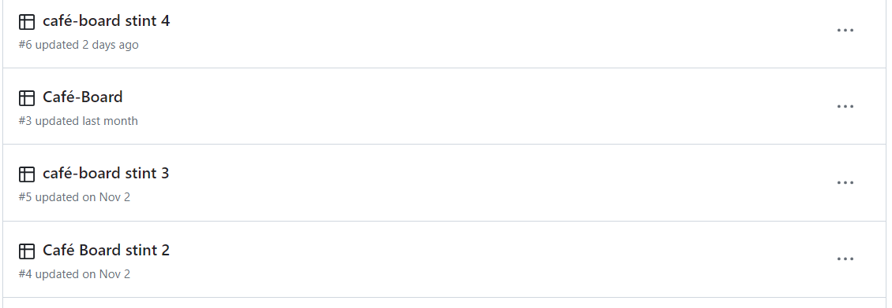

### [Café-board - stint 1](https://github.com/users/leoniemclaughlin7/projects/3)

Stint One of this project focused on the epics account registration, main structure of the site and creating the review app.

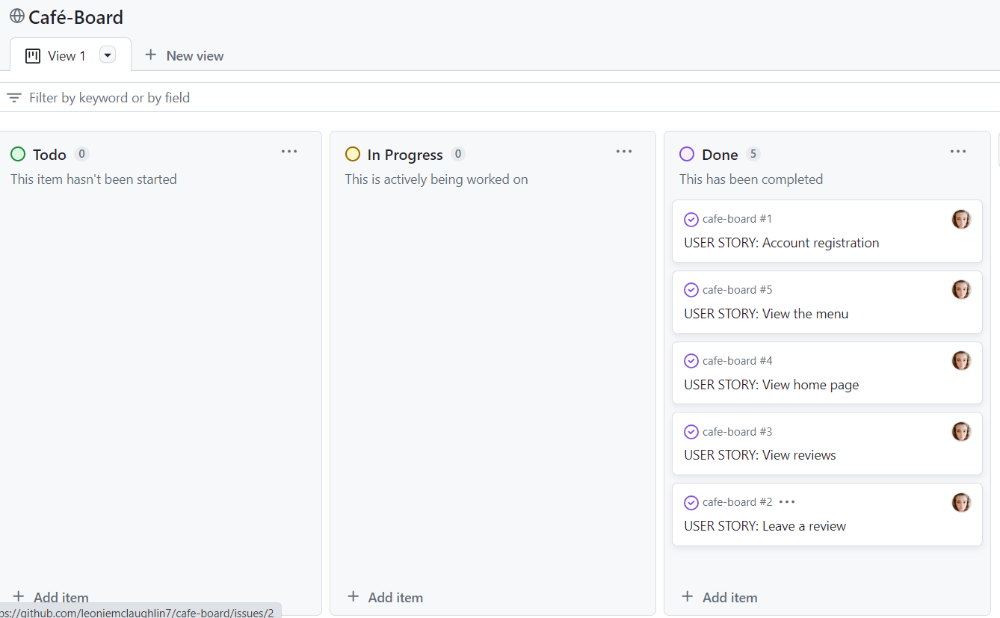

User stories completed during stint 1 include:

* [Account registration](https://github.com/users/leoniemclaughlin7/projects/3/views/1?pane=issue&itemId=38826175)
* [View the menu](https://github.com/users/leoniemclaughlin7/projects/3/views/1?pane=issue&itemId=38896996)
* [View the home page](https://github.com/users/leoniemclaughlin7/projects/3/views/1?pane=issue&itemId=38896620)
* [View reviews](https://github.com/users/leoniemclaughlin7/projects/3/views/1?pane=issue&itemId=38896430)
* [Leave a review](https://github.com/users/leoniemclaughlin7/projects/3/views/1?pane=issue&itemId=38826276)

### [Café-board - stint 2](https://github.com/users/leoniemclaughlin7/projects/4)

Stint Two of this project focused on creating the booking app.

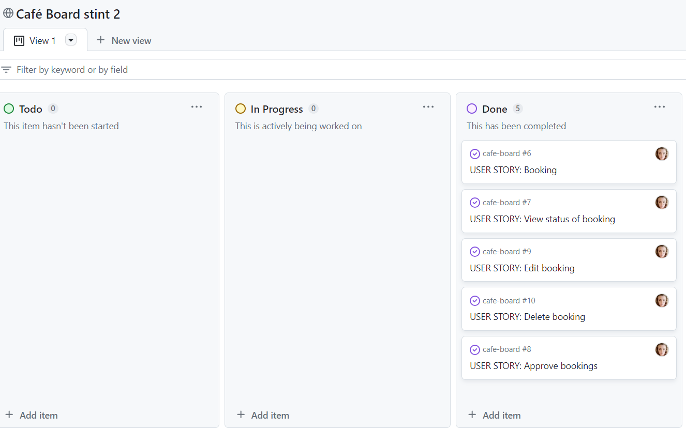

User stories completed during stint 2 include:

* [Booking](https://github.com/users/leoniemclaughlin7/projects/4/views/1?pane=issue&itemId=40185663)
* [View status of a booking](https://github.com/users/leoniemclaughlin7/projects/4/views/1?pane=issue&itemId=40186873)
* [Edit booking](https://github.com/users/leoniemclaughlin7/projects/4/views/1?pane=issue&itemId=40187111)
* [Delete booking](https://github.com/users/leoniemclaughlin7/projects/4/views/1?pane=issue&itemId=40187198)
* [Approve bookings](https://github.com/users/leoniemclaughlin7/projects/4/views/1?pane=issue&itemId=40186986)

### [Café-board - stint 3](https://github.com/users/leoniemclaughlin7/projects/5)

Stint Three of this project continued on with creating the booking app and also looked at  user account administration.  

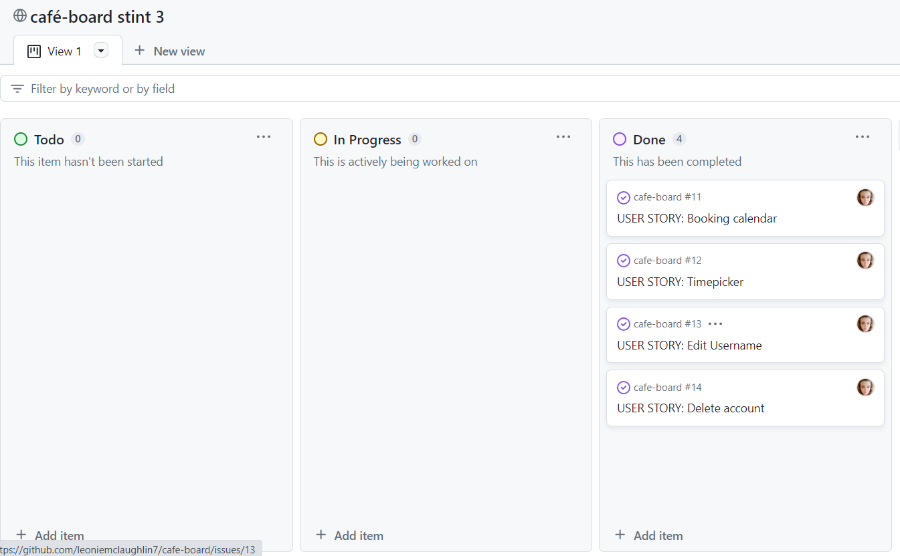

User stories completed during stint 3 include:

* [Booking calander](https://github.com/users/leoniemclaughlin7/projects/5/views/1?pane=issue&itemId=41147670)
* [Timepicker](https://github.com/users/leoniemclaughlin7/projects/5/views/1?pane=issue&itemId=41578875)
* [Edit username](https://github.com/users/leoniemclaughlin7/projects/5/views/1?pane=issue&itemId=41578914)
* [Delete account](https://github.com/users/leoniemclaughlin7/projects/5/views/1?pane=issue&itemId=41578962)
