# Cafe​&#769;-Board

Café-Board is an online booking website for a boardgame café based in Dublin. This website displays information to the user such as opening times, location, menu and what games are available. Users are able to create an account on this website. Once a user is logged in they are able to leave reviews and also make a request for a booking. Bookings can be edited or deteleted depending on their booking status. The user also has the ability to edit their username and email as well as delete their account. The user can also contact the admin of the site by using the contact us section in the footer.

A live version of the project can be accessed here: [Café-Board](https://cafe-board-0e3b1578d9eb.herokuapp.com/)


# User Experience Design

## User Demographic

This website is intended for:

* Users that have a keen interest in boardgames.
* Users that would like to socialise in Dublin.
* Users that wish to book a table in a boardgame café.
* Users that are interested in coffee shops.  

## User Stories

As a User of this website:

* I want to play boardgames with a group of people. 
* I want to be able to book my table. 
* I want to order some coffee and food. 
* I want to be able to leave a review.
* I want to be able to contact site admin with any concerns.
* I want to be able to manage my booking.
* I want to be able to manage my account. 

## Flowchart 

This flowchart was created to determine the flow of the website. It shows which pages are available to the user. It takes into account if the user is logged in to the website or not.

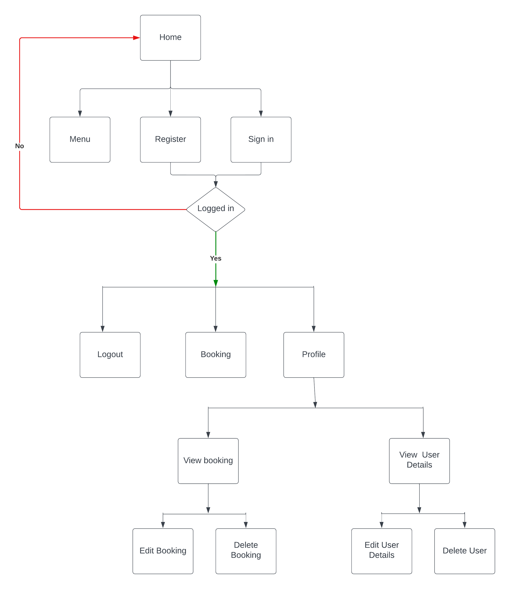

## Entity Relationship Diagram

The database design for this project includes Four tables. The first table is a review table. This table houses all the data associated with making a review on the site. There is a customer table, which houses the details of the customer and this is linked to a booking table via a foreign key relationship. The booking table contains the information needed in order for users to make a booking. The last table present is the user table. This table has the information necessary for users to have an account on the website and has a foreign key relationship with the customer table.

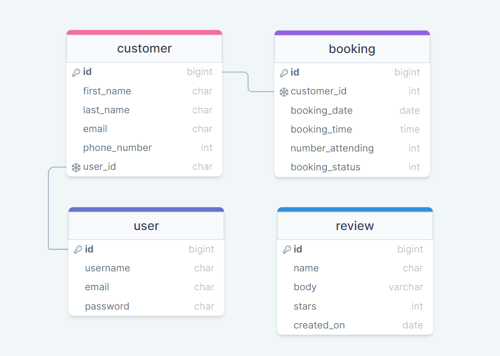

## Wireframes

Wireframes were produced for the home, booking and profile pages on desktop and mobile. Some aspects of the wireframes have changed as the website was being produced.

### Home

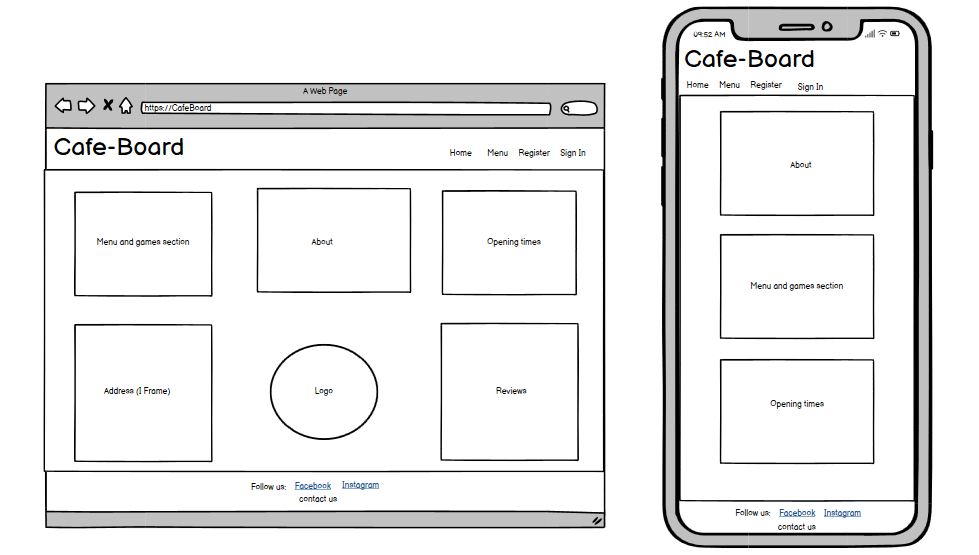

### Booking

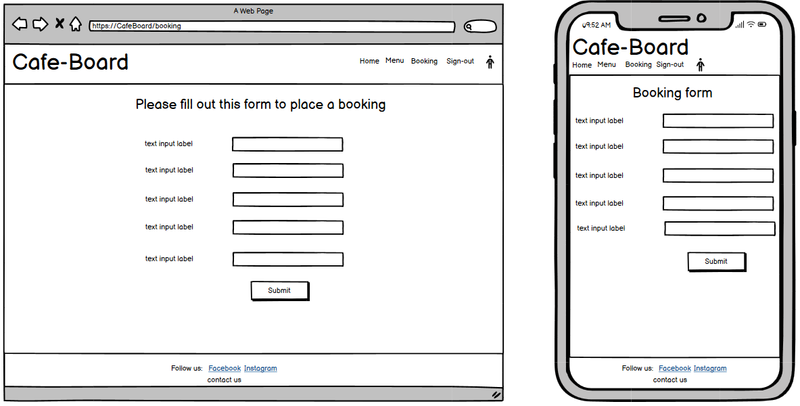

### Profile


## Design

The objective of this project was to design a booking website that is easy to use and that has a clean layout whilst also sticking to the theme of the site which is boardgames and coffee.  

### Colours

The colour palette for this website was derived from [Coolors](https://coolors.co/). The colours that where chosen complement each other while also having coffee tones but bright and retro enough to represent a boardgame café. Below you can see the colours that where used throughout the design of this website.

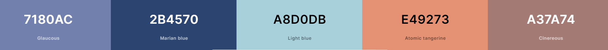

# Agile

Café-Board was developed using Agile Development Methodology. A detailed overview of the Agile process is available [here.](../docs/AGILE.md)

# Features

## Existing features

### Navigation bar

* The navigation bar is seen on all pages of this booking site. 
* It changes depending if the user is logged in or not. 
* When the user is not logged in it contains links to the home, menu, register and sign in page. 
* When the user is logged in it shows links to the home, menu, booking, sign out and profile page. 
* When hovered over the links change colour to the sites background colour. 
* To the left hand side of the navigation bar the name and the logo for café-board can be seen. This logo is clickable and will return the user back to the home page. 

Navigation bar when user is logged out.  


Navigation bar when user is logged in.
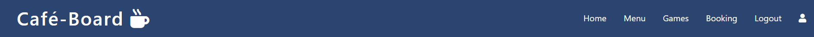

### Hero image with text overlay

* The hero image is displayed on the home page of this booking site.
* The hero image is in line with the theme of this site depicting a coffee and a boardgame.
* It has a text overlay that is responsive and contains a short description of the café.
  
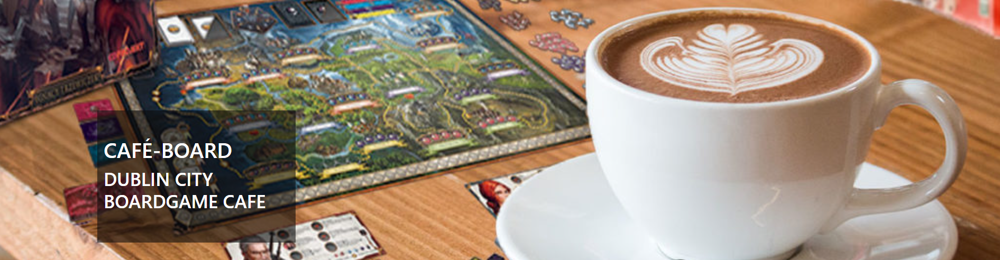

### About section

* The about section contains important information relating to café-board.
* The first card shows a link to both the menu and list of games.
* The second card has a short paragraph about café-board.
* The third card shows the opening times for the café. 

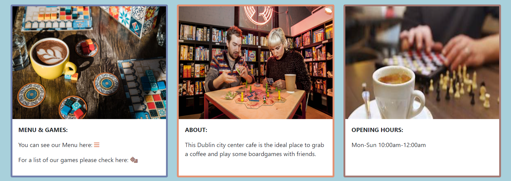

### Address and reviews section

* The location of café-board is provided to the user in the form of an i frame. 
* This I frame contains a random address for a coffee shop in Dublin as café-board is a fictional place currently. 
* When the user is logged out the logo for café-board is shown. 
* When the user is logged in to the site a form is evident to leave a review. 
* The final section shows a scrollable list of reviews left for café-board.

Address and reviews section when user is logged out.
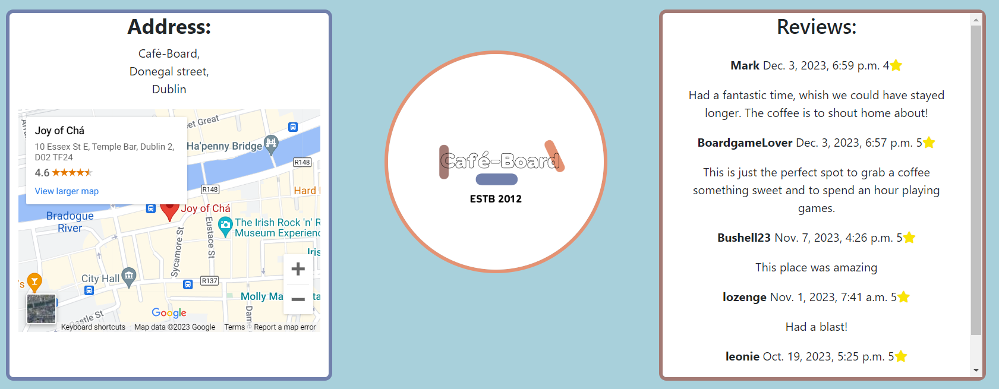

Address and reviews section when user is logged in.
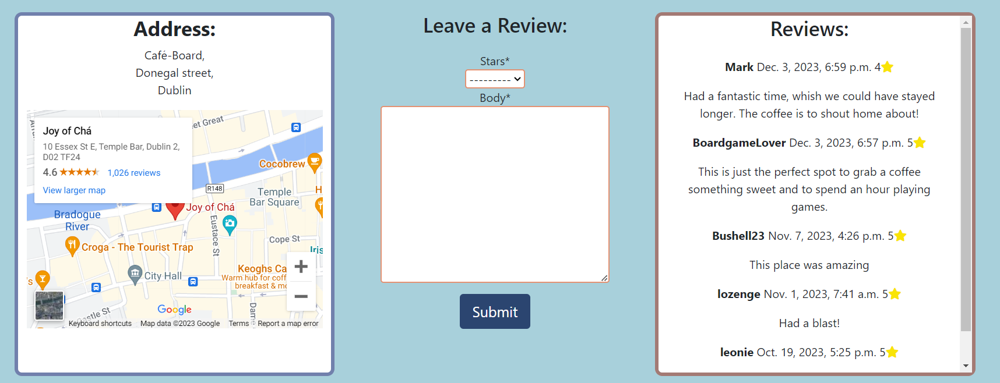

* A success message is displayed to the user once they have posted a review.
  


### Games

* A list of games is provided to the user. This enables them to be more prepared about what they would like to play when booking into café-board.

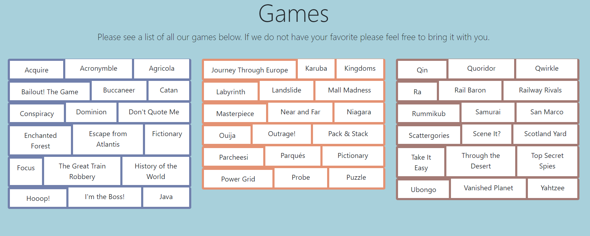

### Menu 

* A menu with prices is available for users so they can see what is available from café-board.
* This menu is collapsible and expands to show the coffee, tea and snack sections of the menu.

Collapsed menu.
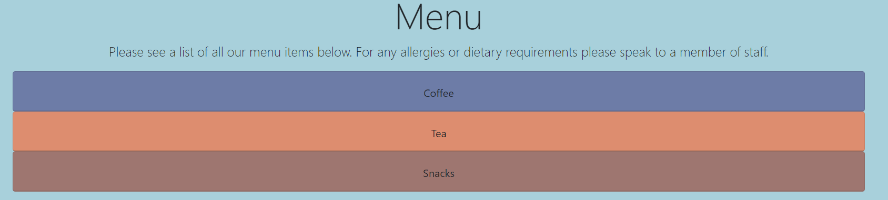

Expanded menu.
<br/>
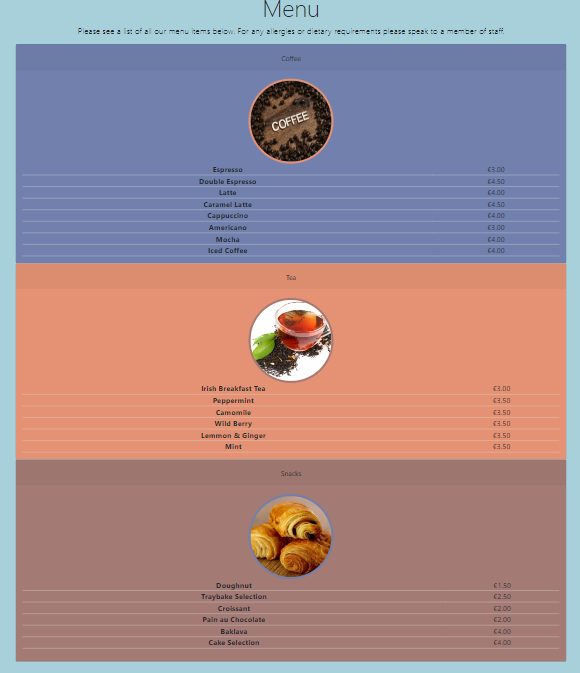

### Register an account

* User can sign up to café-board using the register page.
* If a user signs up they can leave a review, make a booking, view bookings with edit and delete functionality and carry out user account administration.
* In order to register the user must fill out a form that includes their username, an optional email address, and a password.

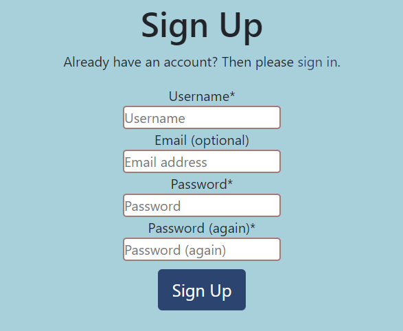

### Sign in

* A sign in page is available to users who have created an account.
* A user must enter their username and password to sign in to café-board.

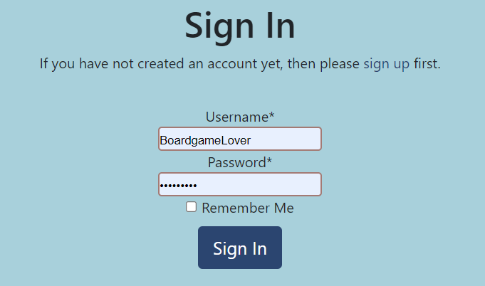

* Once signed in the user is displayed a success message.

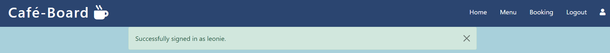

### Booking

* A signed in user can make a booking for the café. 
* Users are asked to fill out a form with important information such as name, email, phone number, booking date, booking time and number attending.

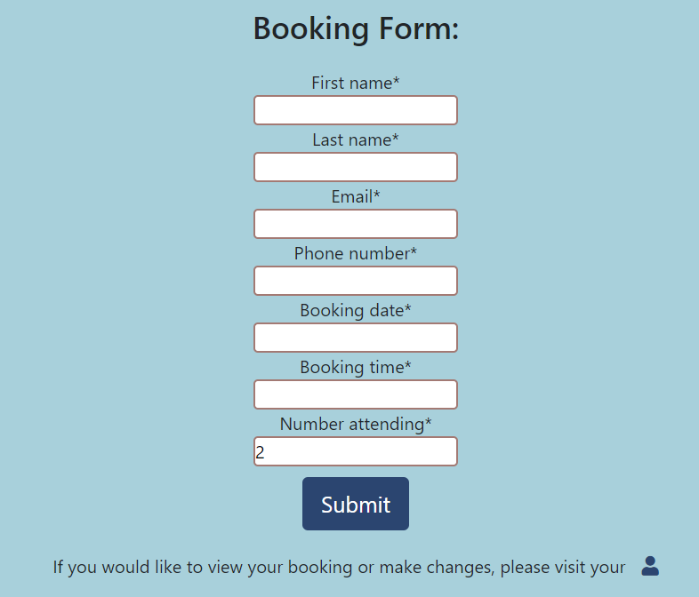

* A date picker widget is used for the booking date, this is more accessible for users. 
* Any confirmed dates which are fully booked are disabled and displayed in red in the date picker.
* Autocomplete for this field is turned off. 

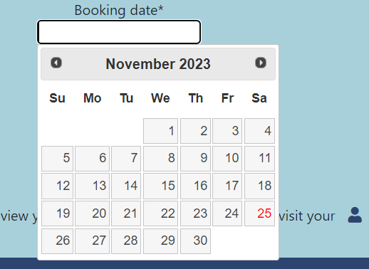

* A time picker is available for the user to choose a One hour time slot.
* The time picker only displays the times in which the café is open. From 10am to 11pm. 
* Café-board is limited to 20 people on any given time slot. If the user tries to book in more attendees than is available on a given date or time (taking into consideration confirmed bookings) they are greeted with an error message.

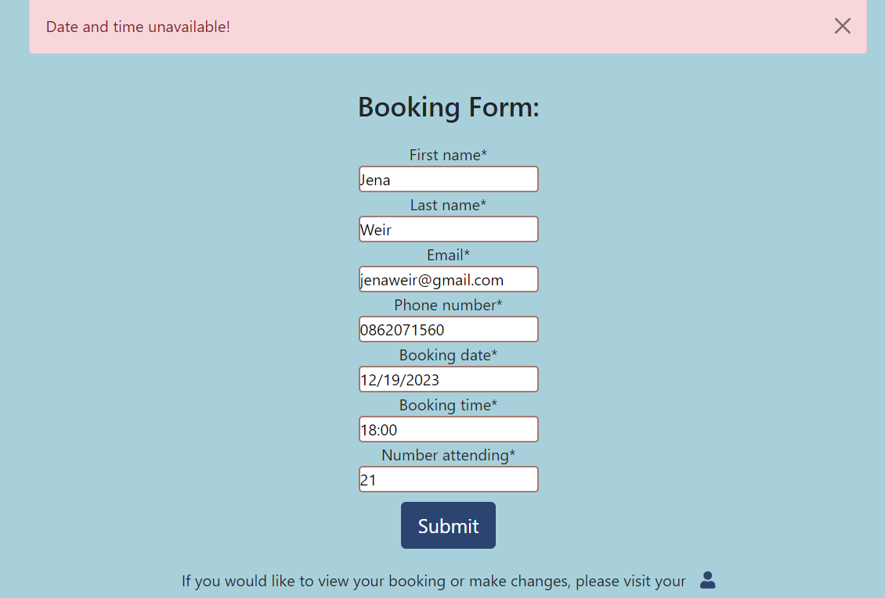

* Upon completion of a successful booking request the user is directed to their profile page.
* A message is displayed in green to inform the user of their successful booking request.

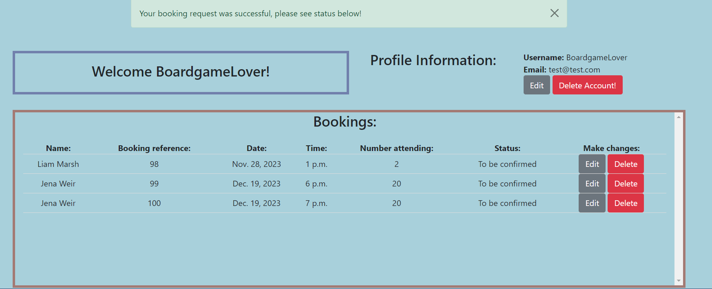

 ### Profile page

 * From the users profile page they are welcomed in by use of their username and some account information is displayed to the user such as their username, email.

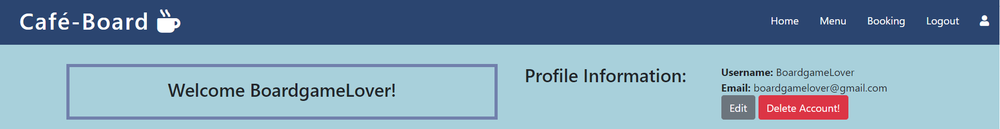

* User can edit their username or email address from this page using the edit button.

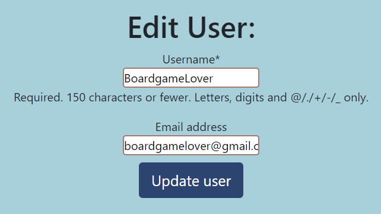

* If a user tries to access another user account by changing the id in the address bar, they are redirected to the profile page with an error message.

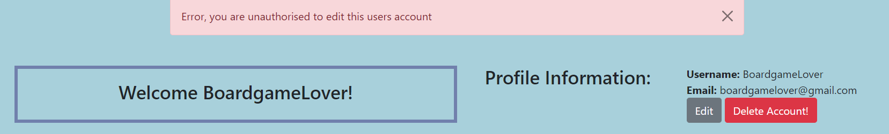

* Users can delete their account from the site.
* If a user account is deleted any booking associated to the user is also deleted due to the foreign key relationship between user and customer.
* A pop up model will confirm if the user is sure they would like to delete their account. This is a good safety measure to prevent the user carrying out an action they did not intend.


* From the profile page the user can also see their bookings.
* If They have not made any bookings yet, the user is informed of this and directed to the booking link to make a booking.

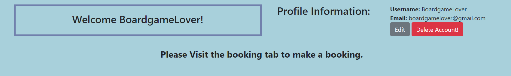

* If the user has available bookings they will be given information relating to the booking such as a reference number and the status of the booking.
* If the booking status is 'Cancelled' or 'Confirmed' the user is given the option to delete their booking.

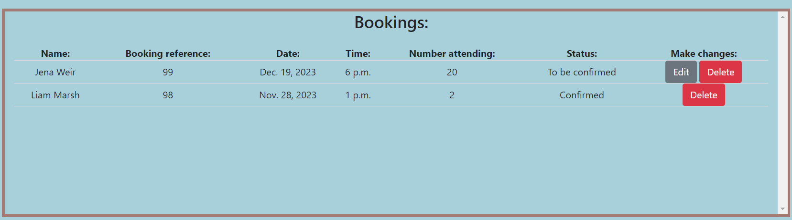

* If the booking status is 'To be confirmed', the user has the option to edit their booking.
* The edit booking form is prepopulated with the original booking information, which allows the user to see what they previously had booked and make any changes in accordance.

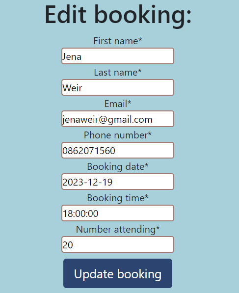

* If the user tries to edit a booking which is not theirs, they are directed back to their profile page and an error message is displayed or they are directed to the 404.html page if the booking is not found.

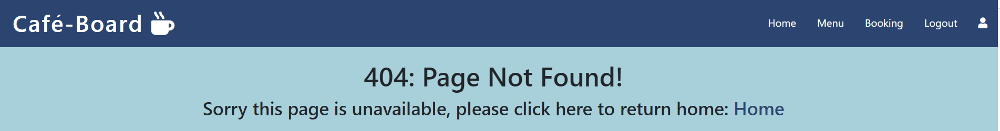

### Logout

* If the user wishes to logout of the site, they can do so by following the link in the nav bar.
* The user will be asked to confirm they would like to logout.

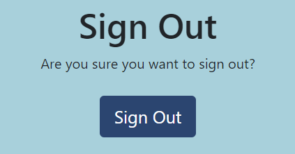

* When the user signs out they are greeted with a pop up message detailing this.

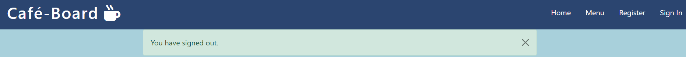

### Footer

* The footer can be seen on all pages of this site.
* It houses information for the user such as social links which open in a new tab and a link to contact site administration.
* The links in the footer change to the sites background colour when hovered over.


### Contact us

* The contact us link in the footer opens a form for the user to fill out.
* The user is asked for their name, email and the message they would like to send.
* Emails will be sent to myself as site admin and this was accomplished using Django emails.
* This is of value to the user as they can have any question they may have about café-board answered or even have their password changed if they have forgotten it.  

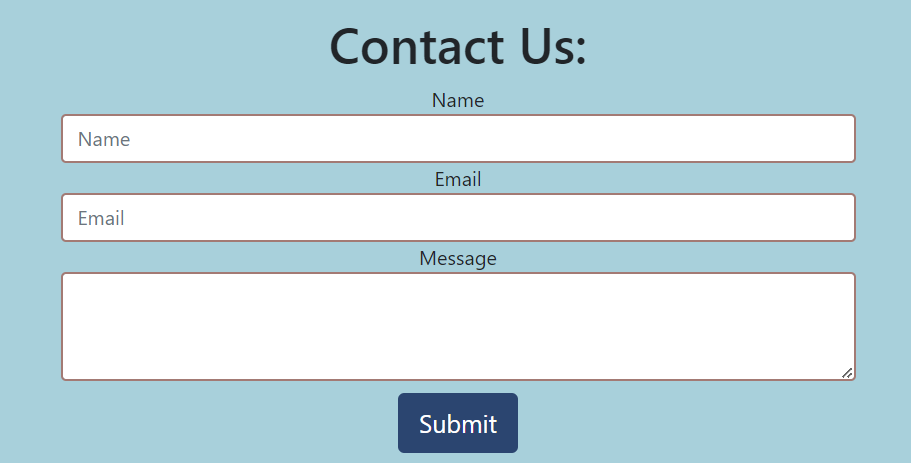

### Administration

* The review admin section is labelled by name, stars and created on. Admin can also filter the reviews depending on stars and created on.

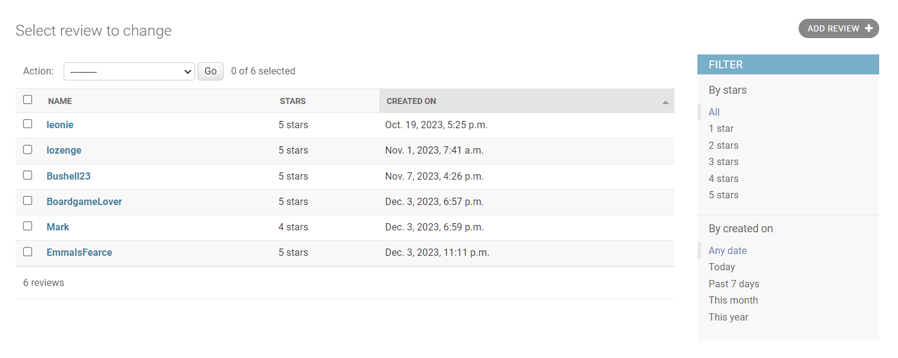

* The booking admin section is labelled by customer, booking date, booking time, number attending and booking status. Admin can also filter the bookings by status and booking date.
* These admin features are nice to have as it allows for easier confirmation of bookings for admin.

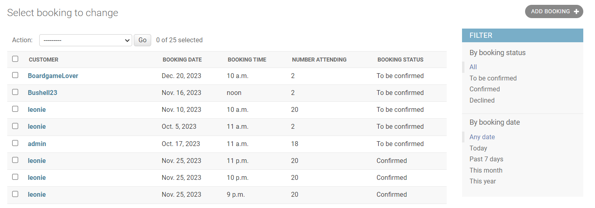

## Future features

There are a number of future features which could be implemented as part of this project in the future.
These include:

1. A forgotten password link. At present a user can request a password change via the contact form, however a forgotten password link on the sign up page would be advantageous to include in this project.
2. Sign in using social accounts. It would be nice to give the user the ability to sign into the site using other social accounts such as Google or Facebook. This future feature would make the sign in process more easily accessible for the user.
3. Dynamic booking. It would be nice to implement a dynamic booking system that takes in to consideration confirmed bookings and displays which times are unavailable on the given date that was chosen. Although some aspects of dynamic booking is present, in that fully booked dates and a limit on the number of attendees is conveyed to the user. It would be nice to show exactly which times are available on each date. This future feature would also make it easier for admin to confirm bookings as only available dates and times would come through to the admin section.
4. Notification of a status change. As a future feature it would be advantageous to be able to notify the user of a status change on their booking by email. This would be more programmatic for the user and saves them having to check in on their status repeatedly.
5. More profile information. It would be nice to allow users to create more profile information such as a profile picture, change their password or enter their customer information so as this is prepopulated for them when carrying out a booking. 
6. Café-board community. It would be nice to add a Reddit style discussion board that allows users to discuss their game play, hobbies or organise get togethers with other boardgame lovers at café-board.

# Testing

Café-Board was tested using both automated and manual testing methodology. A detailed overview of the testing process is available [here.](../docs/TESTING.md)

# known Bugs

All known bugs have been fixed, below is a list of bugs encountered and how they have been fixed.

|Bug  | Status | Solution  |
|--|--|--|
|Saving Two forms as one instance in booking app| fixed| Resolved by using the ```and``` operator to confirm if the forms are valid and then saving the instance individually after all needed actions have been performed.  
|In display_bookings I only wanted to display the booking for the customer that is currently signed in| fixed| Resolved by using the query set filter ```__in``` which matches the customer to the user.
|The edit_booking function allowed users to enter other ids in the address bar and edit other users bookings| fixed| Resolved by using ```if  not customer.user == request.user:``` a conditional statement that checks if the user is the owner of the booking.
|In order to find unavailable dates for the booking app I needed to find all confirmed bookings for any given date | fixed |Resolved by using ```annotate``` to get the sum of the number of attendees on any given date an filter this by the total number of booked attendees which would be 280|
|In order to limit the number of attendees I needed to find a way to check the number of confirmed attendees on a given date.| fixed |Resolved by adding attendees as a parameter into this function and running this alongside the sum of attendees in a conditional check to see if it was over 20, which is the max attendees for any given time slot|
|When sending emails via the contact us form, emails where being sent to admin from admin | fixed |Resolved by using the ```EmailMessage``` class and adding the following line of code, ```reply_to=[from_email]```|
|Review form not posting data to the reviews section| fixed |As the form was posting to the same page ```index.html``` it required an action attribute ```action=""```|
|Receiving an error when trying to run migrations for the booking app |fixed |I needed to remember to register my models in my admin.py file|

# Deployment 

Setting up a basic Django project and deploying to Heroku.

Step 1: Installing Django and supporting libraries.

1. Install Django and gunicorn: ```pip3 install 'django<4' gunicorn```
2. Install supporting libraries: ```pip3 install dj_database_url==0.5.0 psycopg2```
3. Install Cloudinary libraries: ```pip3 install dj3-cloudinary-storage
pip3 install urllib3==1.26.15``` 
4. Create requirements file: ```pip3 freeze --local > requirements.txt```
5. Create project: ```django-admin startproject PROJ_NAME  .```
6. Create app: ```python3 manage.py startapp APP_NAME```
7. In settings.py file, add app to installed apps.
8. In terminal, migrate changes: ```python3 manage.py migrate```
9. Run server to test: ```python3 manage.py runserver```
10. In settings.py file, paste hostname into ALLOWED_HOSTS.

Step 2: Create a new external database on elephantsql.com.

1. Log in to your ElephantSQL account.
2. Click “Create New Instance”.
3. Set up your plan - Give your plan a name, select the Tiny Turtle plan and leave the tag fields blank.
4. Click "Select Region" and choose a data centre near you. 
5. Click "Review", check details and click "Create instance".
6. On ElephantSQL dashboard click on the name of the project you created.
7. Copy your ElephantSQL database URL.

Step 3: Deploying to Heroku.

1. Create new Heroku App.
2. Navigate to settings tab.
3. Click "Reveal Config Vars".
4.  Add a Config Var called DATABASE_URL (This is the URL you copied in step 2).
5. Create an env.py file on top level directory.
6. In env.py, ```import os``` and set environment variables: ```os.environ["DATABASE_URL"] = "Paste in ElephantSQL database URL"```
7. Add in secret key: ```os.environ["SECRET_KEY"] = "Make up your own randomSecretKey"```
8. In heroku.com, add secret key to Config Vars.
9. In settings.py, reference env.py:
 ```
import os 
import dj_database_url 
if os.path.isfile("env.py"): 
import env
```
10. Remove the insecure secret key and replace: ```SECRET_KEY = os.environ.get('SECRET_KEY')```
11. Comment out the old Database section.
12. Add new Database section:
```
DATABASES = {

'default': dj_database_url.parse(os.environ.get("DATABASE_URL"))

}
```
13. In terminal, make migrations: ```python3 manage.py migrate```

Step 4: Store static and media files on Cloudinary.com.

1. Copy your CLOUDINARY_URL from Cloudinary dashboard.
2. Add Cloudinary URL to env.py: ```os.environ["CLOUDINARY_URL"] = "cloudinary://************************"```
3. In Heroku, add Cloudinary URL to Config Vars.
4. Add DISABLE_COLLECTSTATIC to Config Vars: ```DISABLE_COLLECTSTATIC, 1``` (remove before final deployment)
5. In settings.py,  add Cloudinary libraries to installed apps (order is important).
```
INSTALLED_APPS = [
…,
'cloudinary_storage',
'django.contrib.staticfiles',
'cloudinary',
…,
]
```
6. Use Cloudinary to store media and static files.
```
STATIC_URL = '/static/'
STATICFILES_STORAGE = 'cloudinary_storage.storage.StaticHashedCloudinaryStorage'
STATICFILES_DIRS = [os.path.join(BASE_DIR, 'static'), ]
STATIC_ROOT = os.path.join(BASE_DIR, 'staticfiles')

MEDIA_URL = '/media/'
DEFAULT_FILE_STORAGE = 'cloudinary_storage.storage.MediaCloudinaryStorage'
```
7. Link file to the templates directory in Heroku (place under the BASE_DIR line): ```TEMPLATES_DIR = os.path.join(BASE_DIR, 'templates')```
8. Change the templates directory to TEMPLATES_DIR (place within the TEMPLATES array)
```
TEMPLATES = [
  {
	…,
	'DIRS': [TEMPLATES_DIR],
	…,
	  ],
   },
 },
]
```
9.  Add Heroku Hostname to ALLOWED_HOSTS: ```ALLOWED_HOSTS = ["PROJ_NAME.herokuapp.com", "YOUR_HOSTNAME"]```
10. Create a Procfile on the top level directory.
11. In Procfile, add code: ```web: gunicorn PROJ_NAME.wsgi``` 
12. Add, Commit and push files to GitHub.
13. In Heroku, navigate to the deploy tab.
14. Select GitHub as the deployment method.
15. Search for GitHub repository, click connect to link up the GitHub repository to our Heroku app.
16. You can choose to either automatic deploy or manually deploy the app.
17. Automatic deploy will build the app each time it is pushed to GitHub. To enable this choose the branch you would like to deploy and click ```Enable Automatic Deploys```. 
18. To manually deploy the app click ```Deploy Branch```.
19. To view the deployed app click ```Open app``` at the top of the page.

# Credits

## Images

* [Hero image.](https://tampanewsforce.com/wp-content/uploads/2019/03/extremecoffee-1024x683.jpg)
* [Card 1: Escapist,  coffee and boardgames.](https://nz.rs-cdn.com/images/nwsop-y0v9m/grid-gallery/464a01b7a9e10c995c5c6853e82a5ae1__6356/zoom474x378z120000cw474.jpg.webp)
* [Card 2: Timeout, boardgame cafe people.](https://media.timeout.com/images/102903683/image.jpg)
* [Card 3:  Pinterest, coffee and boardgame.](https://www.pinterest.ph/pin/474215035746611952/visual-search/?x=16&y=16.948717948717956&w=532&h=237&cropSource=6)
* [Menu: Picjumbo, roasted coffee beans](https://picjumbo.com/roasted-coffee-beans/)
* [Menu: Centerforhealthyaging, loose tea vs teabag.](https://centreforhealthyaging.org/wp-content/uploads/2014/03/loose-tea-vs-teabag.jpg)
* [Menu: Marmiton, pains au chocolate](https://www.marmiton.org/recettes/recette_pains-au-chocolat_29672.aspx)

## Code

Footer - Assistance with having footer placed at bottom of page using bootstrap.

* [Stack overflow-footer](https://stackoverflow.com/questions/40853952/bootstrap-footer-at-the-bottom-of-the-page)

Iframe - Assistance with converting place name address to google maps URL and Iframe.

* [Stack overflow- Iframe](https://stackoverflow.com/questions/21140338/convert-place-name-address-to-google-maps-url-and-iframe)

Logo - Assistance with centering an image using bootstrap and ordering of the logo with bootstrap flexbox.

* [Stack overflow - Logo centering](https://stackoverflow.com/questions/43226511/how-can-i-center-an-image-in-bootstrap)
* [Sitepoint - Logo bootstrap flexbox](https://www.sitepoint.com/bootstrap-grid-mastering-flexbox/#:~:text=Every%20direct%20child%20element%20of%20a%20flex%20container,sets%20the%20horizontal%20direction%20from%20right%20to%20left)

Date picker -  Assistance with how to initialise a date picker widget, how to disable an array of dates and show an attribute as disabled using pointer events.

* [Stack overflow - Initialise date picker widget](https://stackoverflow.com/questions/61077802/how-to-use-a-datepicker-in-a-modelform-in-django)
* [Stack overflow - Date picker, disable array of dates](https://stackoverflow.com/questions/15400775/jquery-ui-datepicker-disable-array-of-dates)
* [Stack overflow - Date picker, Using pointer events](https://stackoverflow.com/questions/43492742/how-to-use-the-disabled-attribute-for-a-a-tag-in-html)

Modal - Pop up modal for deleting user account.

* [Getbootstrap - Modal](https://getbootstrap.com/docs/5.1/components/modal/)

Time picker - jQuery time picker.

* [Timepicker](https://timepicker.co/#)

Send emails -  Assistance with sending emails with Django and help with bug of sending to and from same email.

* [Opensource - Send emails](https://opensource.com/article/22/12/django-send-emails-smtp)
* [Stack overflow - Resolve sending emails from and to same address](https://stackoverflow.com/questions/59802624/contact-form-sending-emails-from-and-to-the-same-email-django)

Testing python - The following two resources helped with all the python testing in this project.

* [Djangoproject - Testing](https://docs.djangoproject.com/en/4.2/topics/testing/overview/)
* [Mozilla - Django testing](https://developer.mozilla.org/en-US/docs/Learn/Server-side/Django/Testing)

Review model - Assistance with positive integer field on Django models.

* [Geeksforgeeks - Positive integer field](https://www.geeksforgeeks.org/positiveintegerfield-django-models/)

Booking app - Limit number of attendees, assistance of finding the sum of the number of attendees column came from the link below.

* [Stack overflow - Calculating the sum of a coloumn](https://stackoverflow.com/questions/8616343/django-calculate-the-sum-of-the-column-values-through-query)

Assistance with the use of annotate in unavailable dates in the booking app.

* [Stack overflow - Django annotate](https://stackoverflow.com/questions/60249631/how-to-use-django-annotate)

Assistance with saving two forms at once in customer booking in booking app.

* [Stack overflow - Save both forms](https://stackoverflow.com/questions/77218397/how-to-access-instances-of-models-in-view-in-order-to-save-both-forms-at-once?noredirect=1&lq=1)

Assistance with the queryset filter __in, in display booking.

* [W3schools - Queryset filter](https://www.w3schools.com/django/django_queryset_filter.php)

Securing URLs - Assistance with securing URLs in edit booking and edit user.

* [Codu - Securing URLs](https://www.codu.co/articles/securing-django-views-from-unauthorized-access-npyb3to_)

Django nose - Assistance with determining coverage of python tests was carried out by using Django nose.

* [Django testing docs - Coverage](https://django-testing-docs.readthedocs.io/en/latest/coverage.html)
