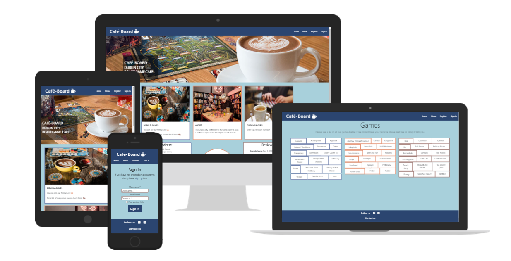
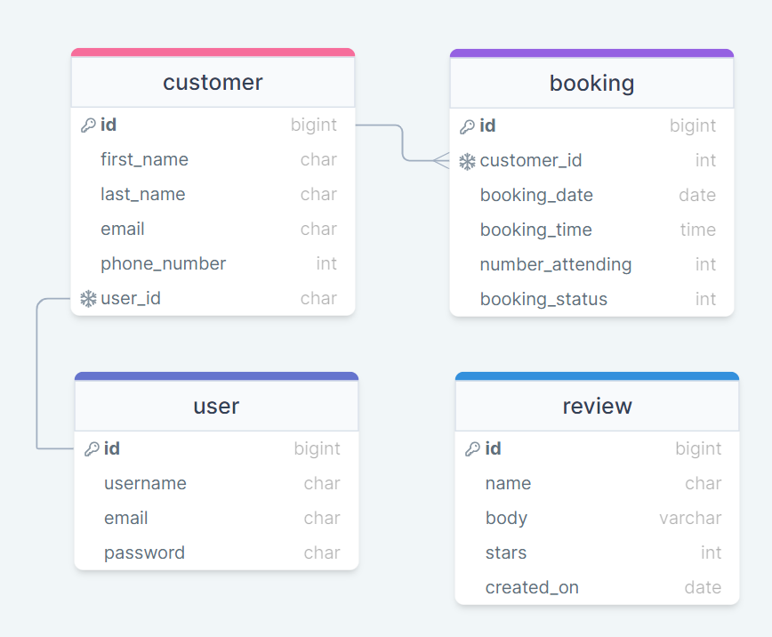
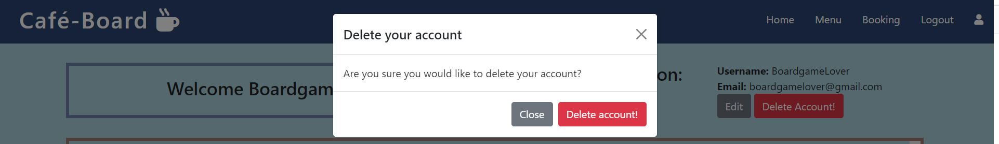

# Cafe​&#769;-Board

Café-Board is an online booking website for a boardgame café based in Dublin. This website displays information to the user such as opening times, location, menu and what games are available. Users are able to create an account on this website. Once a user is logged in they are able to leave reviews and also make a request for a booking. Bookings can be edited or deteleted depending on their booking status. The user also has the ability to edit their username and email as well as delete their account. The user can also contact the admin of the site by using the contact us section in the footer.

A live version of the project can be accessed here: [Café-Board](https://cafe-board-0e3b1578d9eb.herokuapp.com/)

# User Experience Design

## User Demographic

This website is intended for:

* Users that have a keen interest in boardgames.
* Users that would like to socialise in Dublin.
* Users that wish to book a table in a boardgame café.
* Users that are interested in coffee shops.  

## User Stories

As a User of this website:

* I want to play boardgames with a group of people. 
* I want to be able to book my table. 
* I want to order some coffee and food. 
* I want to be able to leave a review.
* I want to be able to contact site admin with any concerns.
* I want to be able to manage my booking.
* I want to be able to manage my account. 

## Flowchart 

This flowchart was created to determine the flow of the website. It shows which pages are available to the user. It takes into account if the user is logged in to the website or not.

## Entity Relationship Diagram

The database design for this project includes Four tables. The first table is a review table. This table houses all the data associated with making a review on the site. There is a customer table, which houses the details of the customer and this is linked to a booking table via a foreign key relationship. The booking table contains the information needed in order for users to make a booking. The last table present is the user table. This table has the information necessary for users to have an account on the website and has a foreign key relationship with the customer table.

## Wireframes

Wireframes were produced for the home, booking and profile pages on desktop and mobile. Some aspects of the wireframes have changed as the website was being produced.

### Home

### Booking

### Profile

## Design

The objective of this project was to design a booking website that is easy to use and that has a clean layout whilst also sticking to the theme of the site which is boardgames and coffee.  

### Colours

The colour palette for this website was derived from [Coolors](https://coolors.co/). The colours that where chosen complement each other while also having coffee tones but bright and retro enough to represent a boardgame café. Below you can see the colours that where used throughout the design of this website.

# Agile

Café-Board was developed using Agile Development Methodology. A detailed overview of the Agile process is available [here.](../docs/AGILE.md)

# Features

## Existing features

### Navigation bar

* The navigation bar is seen on all pages of this booking site. 
* It changes depending if the user is logged in or not. 
* When the user is not logged in it contains links to the home, menu, register and sign in page. 
* When the user is logged in it shows links to the home, menu, booking, sign out and profile page. 
* When hovered over the links change colour to the sites background colour. 
* To the left hand side of the navigation bar the name and the logo for café-board can be seen. This logo is clickable and will return the user back to the home page. 

Navigation bar when user is logged out.  

Navigation bar when user is logged in.

### Hero image with text overlay

* The hero image is displayed on the home page of this booking site.
* The hero image is in line with the theme of this site depicting a coffee and a boardgame.
* It has a text overlay that is responsive and contains a short description of the café.
  

### About section

* The about section contains important information relating to café-board.
* The first card shows a link to both the menu and list of games.
* The second card has a short paragraph about café-board.
* The third card shows the opening times for the café. 

### Address and reviews section

* The location of café-board is provided to the user in the form of an i frame. 
* This I frame contains a random address for a coffee shop in Dublin as café-board is a fictional place currently. 
* When the user is logged out the logo for café-board is shown. 
* When the user is logged in to the site a form is evident to leave a review. 
* The final section shows a scrollable list of reviews left for café-board.

Address and reviews section when user is logged out.

Address and reviews section when user is logged in.

### Games

* A list of games is provided to the user. This enables them to be more prepared about what they would like to play when booking into café-board.

### Menu 

* A menu with prices is available for users so they can see what is available from café-board.
* This menu is collapsible and expands to show the coffee, tea and snack sections of the menu.

Collapsed menu.

Expanded menu.
 

### Register an account

* User can sign up to café-board using the register page.
* If a user signs up they can leave a review, make a booking, view bookings with edit and delete functionality and carry out user account administration.
* In order to register the user must fill out a form that includes their username, an optional email address, and a password.

### Sign in

* A sign in page is available to users who have created an account.
* A user must enter their username and password to sign in to café-board.

### Booking

* A signed in user can make a booking for the café. 
* Users are asked to fill out a form with important information such as name, email, phone number, booking date, booking time and number attending.

* A date picker widget is used for the booking date, this is more accessible for users. 
* Any confirmed dates which are fully booked are disabled and displayed in red in the date picker.
* Autocomplete for this field is turned off. 

* A time picker is available for the user to choose a One hour time slot.
* The time picker only displays the times in which the café is open. From 10am to 11pm. 
* Café-board is limited to 20 people on any given time slot. If the user tries to book in more attendees than is available on a given date or time (taking into consideration confirmed bookings) they are greeted with an error message.

* Upon completion of a successful booking request the user is directed to their profile page.
* A message is displayed in green to inform the user of their successful booking request.

 ### Profile page

 * From the users profile page they are welcomed in by use of their username and some account information is displayed to the user such as their username, email.

* User can edit their username or email address from this page using the edit button.

* If a user tries to access another user account by changing the id in the address bar, they are redirected to the profile page with an error message.

* Users can delete their account from the site.
* If a user account is deleted any booking associated to the user is also deleted due to the foreign key relationship between user and customer.
* A pop up model will confirm if the user is sure they would like to delete their account. This is a good safety measure to prevent the user carrying out an action they did not intend.

* From the profile page the user can also see their bookings.
* If They have not made any bookings yet, the user is informed of this and directed to the booking link to make a booking.

* If the user has available bookings they will be given information relating to the booking such as a reference number and the status of the booking.
* If the booking status is 'Cancelled' or 'Confirmed' the user is given the option to delete their booking.

* If the booking status is 'To be confirmed', the user has the option to edit their booking.
* The edit booking form is prepopulated with the original booking information, which allows the user to see what they previously had booked and make any changes in accordance.

