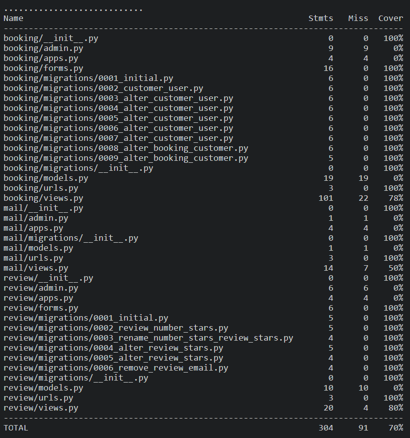
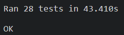

# Testing 

Café-Board was tested using both automated and manual testing methodology.

## Automated testing

### Python testing

The Python in this project was tested using python testing. Coverage was determined by installing Django-nose. Coverage by automated python tests in this project was 70%. This percentage could be higher however manual testing will cover the 30% that is missed by automated testing.

## Manual testing

Testing of the functionality of the website can be seen in the following tables. Each section of the website has been tested according to the feature on the deployed site. Testing different devices and screen resolutions has been conducted using Google DevTools.

### Navigation Bar 

|Feature  | Expect  | Action | Result | 
|--|--|--|--|
| Logo  | When the logo is clicked it will return the user to the home page |Clicked logo | pass
| Home nav link| When clicked it will direct the user to the home page |Clicked Home on the nav bar | pass
|Menu nav link| When clicked it will direct the user to the menu |Clicked Menu on the nav bar | pass
|Register nav link| When clicked it will direct the user to the sign up page |Clicked Register on the nav bar | pass
| Sign in nav link| When clicked it will direct the user to the sign in page |Clicked Sign in on the nav bar | pass
|Nav menu responsive |When browser is resized the nav bar will remain responsive across all device sizes |Resized browser across different device sizes| pass

### Hero Image

|Feature | Expect | Action | Result |
|--|--|--|--|
|Hero image responsive |When the screen size is changed the image does not distort and fits to screen |Resized browser and checked hero image at different screen resolutions | pass
|Text overlay responsive |At different device resolutions the text overlay remains in position| Resized browser and checked the text overlay at different screen resolutions |pass

### About Section

|Feature | Expect | Action | Result |
|--|--|--|--|
|About cards responsive |When the screen size is changed the about cards will adapt to the different screen size |Resized browser and checked about cards at different screen resolutions | pass
|Menu icon clickable| When clicked the menu icon will open the menu page| Clicked the menu icon |pass
|Games icon clickable| When clicked the games icon will open the games page| Clicked the games icon |pass

### Address and reviews section

|Feature | Expect | Action | Result |
|--|--|--|--|
|Address and reviews section logged out |When user is logged out, address, logo and reviews should be shown to the user |Observed address and review section when user is logged out | pass
|Address and reviews section logged in |When user is logged in, address, review form and reviews should be shown to the user |Observed address and review section when user is logged in | pass
|Address I frame | The I frame allows you to zoom in and out of the map, move the map around by clicking and dragging the mouse and will open Google maps in a new tab when 'View larger map' is clicked |Zoomed in and out of I frame, clicked and dragged mouse over I frame and clicked 'View larger map' |pass
|Reviews scrollable| When the review container is full the user shall be able to scroll through reviews |Scrolled through reviews | pass
|Leave a review| When the user is logged in they can fill out a form to leave a review by pressing the submit button |Filled out review form and pressed submit button | pass
|Leave a review - empty input| If the user tries to submit the review form with either of the Two field left blank, a pop up message will detail that these fields are required |Press submit button with field left blank | pass
|Leave a review - success message |When user submits a review a success message will appear at the top of the page |Observed if a success message is displayed to the user upon submitting a review | pass
|Address and review section responsive |When the screen size is changed the address and review section will adapt to the different screen size |Resized browser and checked the address and review section at different screen resolutions | pass

